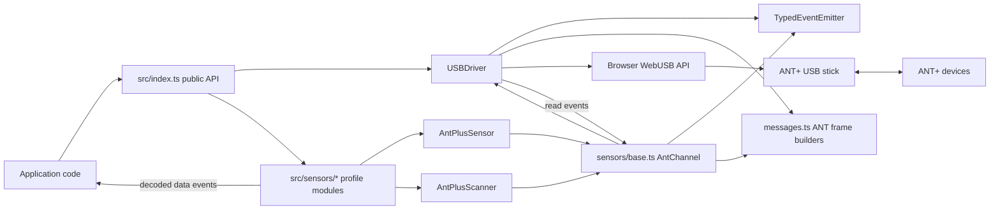
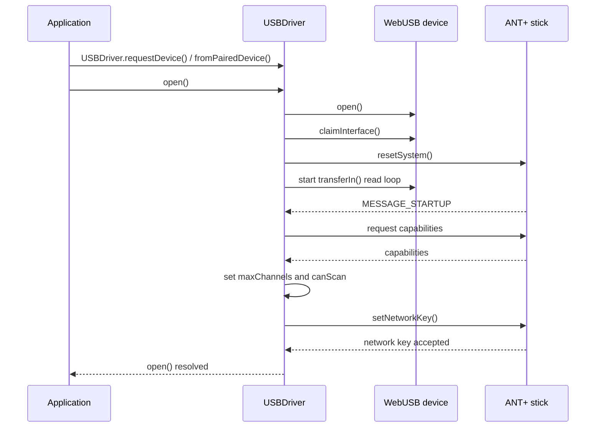
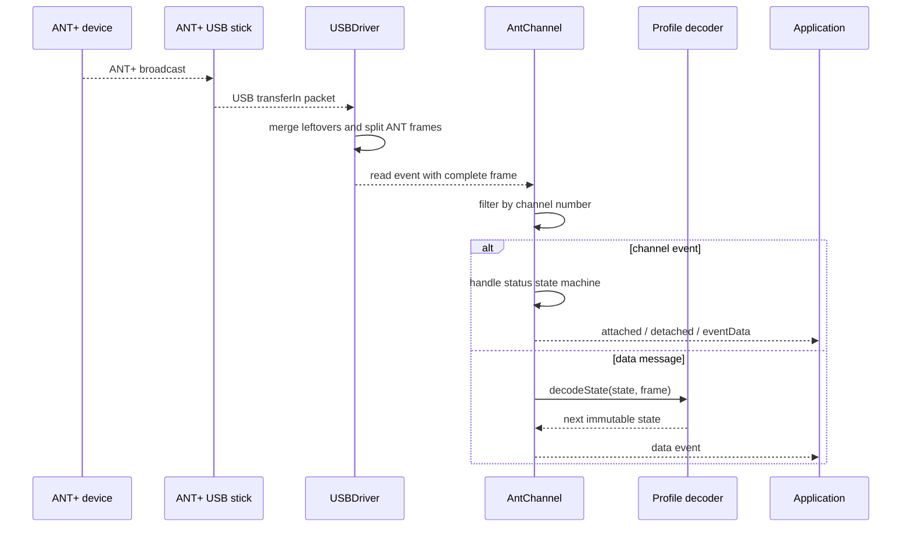

# Architecture

This document explains the internal structure of `web-ant-plus` for maintainers
who need to extend or debug the library.

## Overview

`web-ant-plus` is an ESM TypeScript library that talks to ANT+ USB sticks from
the browser through WebUSB. The code is organized around four layers:

1. `USBDriver` owns the WebUSB device, startup handshake, read loop, and channel
   allocation.
2. `messages.ts` builds and parses low-level ANT message frames.
3. `AntPlusSensor` and `AntPlusScanner` implement shared ANT channel lifecycle
   behavior.
4. Profile modules in `src/sensors/` decode profile-specific data pages and
   expose typed sensor/scanner classes.

The public package surface is centralized in `src/index.ts`.

## System Diagram



## Source Map

```text
src/
├── index.ts                  # public API exports
├── driver.ts                 # USBDriver, WebUSB I/O, startup, channels
├── messages.ts               # ANT frame builders and shared byte offsets
├── constants.ts              # ANT protocol constants
├── errors.ts                 # package-specific Error subclasses
├── lib/
│   ├── CancellationToken.ts  # read-loop shutdown cancellation
│   └── TypedEventEmitter.ts  # browser-safe typed event emitter
├── sensors/
│   ├── base.ts               # AntPlusSensor and AntPlusScanner plumbing
│   ├── bicyclePower.ts       # Bicycle Power profile
│   ├── cadence.ts            # Cadence profile
│   ├── environment.ts        # Environment profile
│   ├── fitnessEquipment.ts   # Fitness Equipment profile and commands
│   ├── heartRate.ts          # Heart Rate profile
│   ├── muscleOxygen.ts       # Muscle Oxygen profile and commands
│   ├── speed.ts              # Speed profile
│   ├── speedCadence.ts       # Speed and Cadence profile
│   └── strideSpeedDistance.ts # Stride Speed Distance profile
└── testing/
    └── fakeUsb.ts            # fake WebUSB objects for tests
```

## Runtime Flow

### Driver Startup

Application code creates a driver through one of the static factories:

- `USBDriver.requestDevice()` opens the browser picker with supported ANT+ stick
  filters.
- `USBDriver.fromPairedDevice()` wraps the first already permitted supported
  stick.
- `USBDriver.fromDevice(device)` wraps a caller-provided `USBDevice` without
  checking the product id.

`driver.open()` opens the USB device, claims the first interface, locates input
and output endpoints, resets the ANT stick, starts the read loop, and waits for
the startup handshake to complete. The handshake sequence is:

1. reset system
2. receive startup message
3. request capabilities
4. record `maxChannels` and `canScan`
5. set the ANT+ network key
6. emit `startup`

After `open()` resolves, sensors can attach.



### Read Loop and Message Dispatch

`USBDriver` continuously reads from the input endpoint with `transferIn()`. USB
packets can contain partial or multiple ANT frames, so the driver keeps a
leftover buffer and splits incoming data into complete ANT messages.

Driver-owned startup messages are handled inside `USBDriver`. All other complete
messages are emitted as the driver's typed `read` event. Channel instances listen
to this event and ignore messages that do not match their active channel.



### Channel Allocation

The driver tracks channel usage with two modes:

- regular sensors increment `#usedChannels` until `maxChannels` is reached
- scan mode uses `#usedChannels === -1` and requires exclusive access

This means regular sensor channels and background scanning are mutually
exclusive. `driver.detach()` and `driver.detachAll()` keep the driver's channel
bookkeeping aligned with channel lifecycle events.

## Channel Abstractions

`src/sensors/base.ts` contains a private `AntChannel` base class shared by
sensors and scanners. It is responsible for:

- binding a channel number and device identity
- routing driver `read` messages to the active channel
- handling common channel status events
- closing and unassigning channels
- serializing acknowledged outgoing messages through a small queue

`AntPlusSensor<TState>` represents one ANT+ device on one channel. Its
`attach()` flow assigns the channel, sets the device id/type, search timeout,
frequency, period, library config, and opens the channel. It stores one latest
state snapshot and emits `data` with an immutable replacement object whenever a
profile decoder returns a new state.

`AntPlusScanner<TState>` represents background scanning for one ANT+ profile.
It requires `driver.canScan`, opens channel `0` in scan mode, enables extended
messages, and maintains a `Map` from device id to latest state. Scan data uses
extended ANT metadata to identify the source device and can also include RSSI
and threshold values.

Both classes expose the same high-level event model: `data`, `attached`,
`detached`, and `eventData`.

## Profile Modules

Each profile module follows the same pattern:

- state interfaces describe the immutable state exposed to users
- a pure `decode*` function parses one ANT+ broadcast page and returns the next
  state
- a `*Sensor` class extends `AntPlusSensor` and supplies `deviceType`, `period`,
  initial state creation, and decoder state such as page trackers
- a `*Scanner` class extends `AntPlusScanner` and supplies `deviceType`, initial
  scan state creation, and per-device decoder state where needed

The pure decoder functions are exported intentionally. They let tests and user
code replay recorded ANT data without WebUSB hardware.

Profiles that need outgoing control commands add payload builders and methods on
their sensor class. For example:

- `FitnessEquipmentSensor` sends resistance, target power, user configuration,
  wind resistance, and track resistance acknowledged messages.
- `MuscleOxygenSensor` sends session and time commands.

## State Design

State objects are treated as immutable snapshots:

- public state interfaces use `readonly` fields
- decoders return merged state objects instead of mutating the previous state
- every `data` event receives the latest snapshot

Some ANT+ pages contain rollover counters or page toggles. Modules keep the
minimum profile-specific tracker state needed to decode those values correctly.
For sensors, tracker state usually lives in a private field. For scanners, it is
usually keyed by device id because one scanner receives messages from multiple
devices.

## Message Layer

`messages.ts` is the only place that constructs raw ANT command frames. It:

- defines byte offsets used by driver and sensor code
- computes ANT checksums
- builds `DataView<ArrayBuffer>` messages
- encodes little-endian integer payload fields
- exposes small functions for each command used by the channel state machines

Keeping frame construction centralized makes profile modules mostly about data
page decoding rather than ANT framing.

## Events and Errors

The project does not depend on Node's `EventEmitter`, because the library runs
in browsers. `TypedEventEmitter` provides a minimal browser-safe event API with
compile-time checked event names and payloads.

Package errors derive from `AntPlusError`:

- `DeviceNotFoundError` for missing USB interfaces or endpoints
- `ChannelStateError` for invalid attach/scan/detach state
- `ProtocolError` for malformed ANT data

Driver read-loop failures are emitted through the driver's `error` event.

## Adding a New Profile

To add another ANT+ profile:

1. Add `src/sensors/<profile>.ts`.
2. Define `SensorState` and `ScanState` interfaces.
3. Implement and export a pure `decode<Profile>()` function.
4. Implement `<Profile>Sensor` with the ANT+ `deviceType`, channel `period`,
   `createState()`, and `decodeState()`.
5. Implement `<Profile>Scanner` with the same `deviceType`, `createState()`,
   and scanner-safe decoder tracking.
6. Export the module from `src/index.ts`.
7. Add focused decoder and channel tests under `src/sensors/*.test.ts`.

Prefer keeping payload builders pure and exported when commands need to be
tested independently from WebUSB.

## Testing and Build

The library uses Vitest for tests, Biome for linting/formatting, and TypeScript
strict mode for type checking. Useful commands are:

```sh
npm test
npm run typecheck
npm run check
npm run build
```

Tests that exercise USB behavior should use `src/testing/fakeUsb.ts` instead of
real hardware. Decoder tests should call the exported pure decoder functions
directly where possible.
